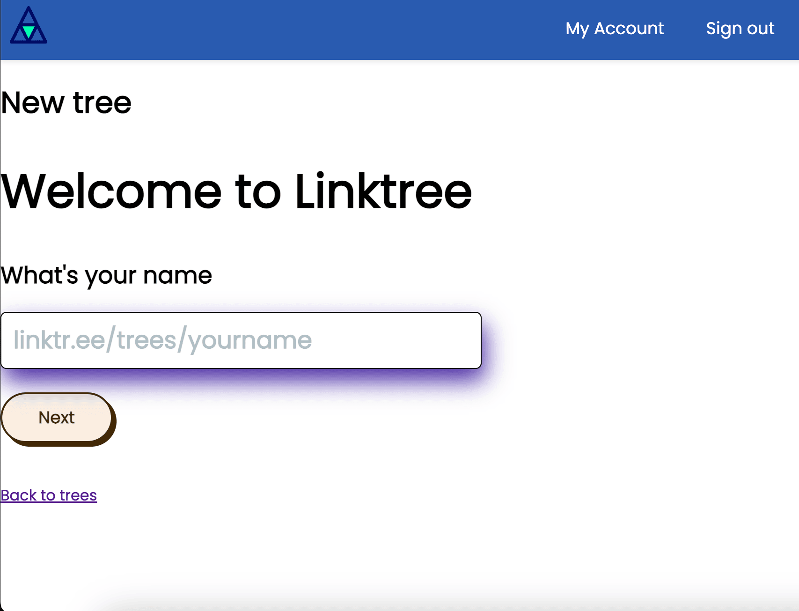
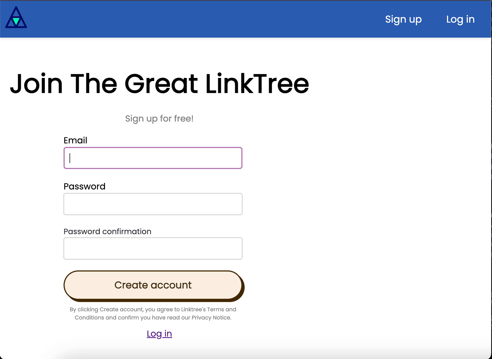
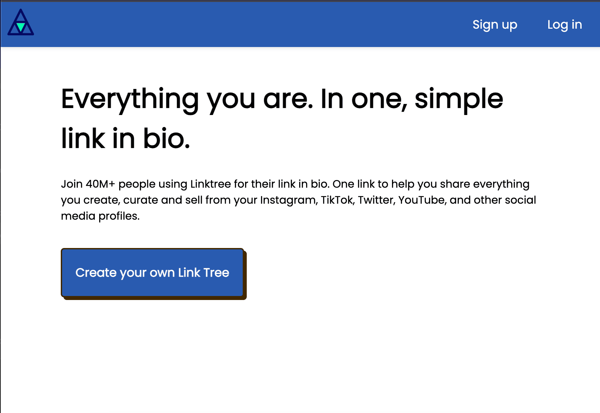

# Ruby on Rails Linktree Clone

This is a work-in-progress project built using **Ruby on Rails**, inspired by a Linktree-style landing page. The goal is to explore Ruby on Rails development from the ground up by following a guided walkthrough, while applying my own full-stack background and development style.

## Tech Stack

- **Ruby on Rails**
- **PostgreSQL**
- **Node.js & Yarn** for asset management
- **Devise** for authentication
- **Bootstrap** for styling
- **FriendlyID** for user-friendly URLs
- **Fly.io** (planned deployment platform)

## Purpose

This is my first Ruby on Rails project. While I'm new to the Rails ecosystem, I’ve built several full-stack apps using:

- The **MERN stack** (MongoDB, Express, React, Node)
- **Go** and various MVC-based frameworks
- RESTful APIs and CRUD operations in multiple stacks

This project demonstrates my ability to learn new languages and frameworks quickly, build scalable applications, and follow MVC architecture best practices.

## What I’ve Learned (so far)

- Rails project structure and MVC fundamentals
- Scaffolding and resource generation
- User authentication using Devise
- Creating and rendering partials for layout reuse (e.g., navbars)
- Working with PostgreSQL in a Rails app
- Adding FriendlyID for clean URLs
- Basic deployment prep with Fly.io
- Validations and user-to-resource relationships

## Screen Shots
*Log In*

*New User*

*Home Page*

## Installation Links

- [Yarn](https://classic.yarnpkg.com/lang/en/docs/install/)
- [Node.js](https://nodejs.org/en/download)
- [Rails Installer](https://railsinstaller.org/)
- [Ruby Installer](https://rubyinstaller.org/)
- [PostgreSQL](https://www.postgresql.org/download/)
- [PowerShell (for Windows)](https://learn.microsoft.com/en-us/powershell/)
- [Fly.io Hosting](https://fly.io)

Working in a MVC app for Link TRee style app. 

routes.rb - goes to views/home/index

scaffodling lets you creat a CRUD layout
one command for all the CRUD paths.
"rails g scaffold tree" makes the start of crud scaffold then you add what you want in there "name:string instagram:string" and it creates those paths.
*important* you have to then enter "rails db:migrate:"
